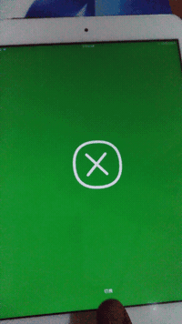

# Open&Close
>  swift编写，原型来自dribble

## 使用的第三方库
* snapkit（简单的做下布局约束）
* pop(facebook出品的动画框架)

## 完成的实机效果图

### 用到了基本的CALayer(上下两条线)和CAShapeLayer(中间线和圆)并用strokeStart和strokeEnd来控制贝塞尔曲线显示的区间，用到POP这个框架，不过由于我是一直搞安卓的,用过rebound(类pop的安卓上的弹簧效果框架)，所以我做法是控制一段0~1的数据，映射到绘图时所需要的数据，再刷新，就得到了我想要的动画。